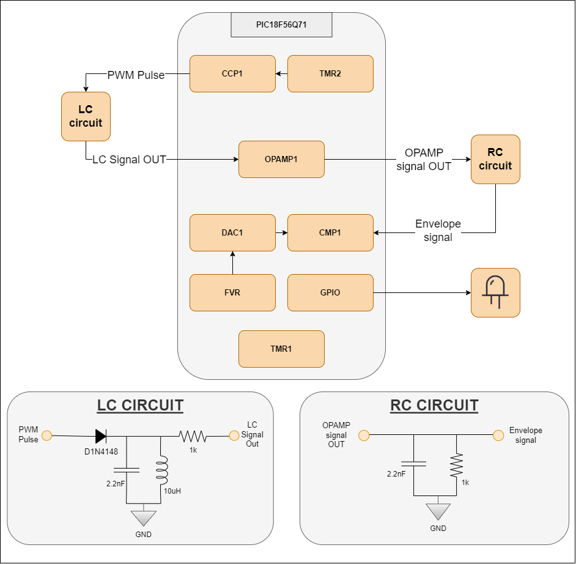

<!-- Please do not change this html logo with link -->

# Proximity Metal Detector Using an Operational Amplifier (OPA) — User Case for PIC18F56Q71 Microcontroller with MCC Melody 

This application uses an inductive sensor consisting of one capacitor and one inductive sensor placed in parallel. This application note shows how a proximity metal detector can be designed using the integrated OPA of the PIC18F Q71 family.

 

## Related Documentation

More details and code examples on the PIC18F56Q71 can be found at the following links:

- [PIC18F56Q71 Product Page](https://www.microchip.com/en-us/product/PIC18F56Q71)
- [PIC18F56Q71 Code Examples on GitHub](https://github.com/microchip-pic-avr-examples/?q=pic18f56q71)

## Software Used

- [MPLAB® X IDE v6.05 or newer](http://www.microchip.com/mplab/mplab-x-ide)
- [MPLAB® XC8 v2.41 or newer](http://www.microchip.com/mplab/compilers)
- [PIC18F-Q Series Device Pack v1.16.368 or newer](https://packs.download.microchip.com/)

## Hardware Used

- The PIC18F56Q71 Curiosity Nano Development Board is used as a test platform:
     

- Curiosity Nano Adapter:
     

- PROTO CLICK Board:
     

- 1x 1N4148 Diode

- 1x 10 µH Inductor

- 2x 1 kOhm Resistor

- 2x 2.2 nF Capacitor 50V

## Operation

To program the Curiosity Nano board with this MPLAB X project, follow the steps provided in the [How to Program the Curiosity Nano Board](#how-to-program-the-curiosity-nano-board) chapter.  

## Working Principle

The metal detector operates based on the principle of electromagnetic induction. The LC sensor detects the metals using one inductor coil and one capacitor grouped in a parallel circuit. The LC circuit works like an electrical resonator, and it oscillates at the resonant frequency of the circuit using stored energy (Signal A). When a metal object approaches the proximity of a varying magnetic field generated by the inductor coil, currents are induced in the metal object. 
 The Eddy currents induce their own magnetic field. The oscillating signal will attenuate faster, due to the energy absorbed by the currents within the metal. The signal period will be reduced and the amplitude of the signal will attenuate too (Signal B). 

 
 

 
If the overlapping between Signal A and Signal B occurs in the beginning or end phase, then the Signal A and Signal B amplitude is lowered. When the overlapping occurs in-between the two phases, the Signal A and Signal B amplitude is higher. The signal is perpetually increasing when tracing its envelopes, it reaches the peak value at the midst phase, and returns to zero at the end phase. The maximum difference between the two envelopes must be used when configuring the metal detector.
 When the envelope reaches its peak, the measuring period starts. It stops when the maximum distance between Signal A (green) and Signal B (red) is met, as it is represented in the figure below. This value is compared with the non-metal value and can provide information about the distance for a specific metal (the amplitude varies for different types of metals used, considering the environmental conditions do not change). 

  
 
The solution for metal detector using Q71 family MCU uses the LC sensor, the integrated OPA and the RC circuit to create the envelope of the resulted signal. The CCP1 peripheral is used to generate the PWM signal, with the period set using the Timer2 (TMR2) peripheral, to charge the capacitor and generate the oscillation with LC circuit. This signal is the input for the integrated OPA with unity gain configuration. The output signal of the OPA is the input for the LC circuit that defines the envelope signal. Using the comparator (CMP) peripheral, the value of the envelope is compared with a fixed voltage set by the Digital-to-Analog Converter (DAC) peripheral, and the TMR1 module counts between the peak of the envelope and the set voltage level, then one GPIO toggles once the set condition is met.

  

Also, the frequency or the period of generated oscillations varies when a metal object interferes with the magnetic field of a metal detector. The frequency or the period of oscillations can be used as secondary information to provide a precise measurement of the distance to the metal object.

## Software Architecture

This project has multiple functions, every single one having a name that describes the main purpose of it. There are two types of functions in this code, MPLAB® Code Configurator (MCC) generated functions and the main purpose of the application:

-	`App_PrepareEnvelope`
-	`App_ChargingPulseGen`
-	`App_ThrshldTimeMeas`
-	`App_CheckEnvelopeThrsld`
-	`App_ResetTimer`
-   `App_ThrsldMeasDefaultValue`

The `System_Initialize` function is called at the beginning of the code and includes all the used peripherals initialization that is generated and configured using the MCC Melody. It configures the main clock of the project, the pin management, the CMP, the DAC, the FVR, the OPA, the CCP, and the timers, all those modules being used in development of the project. Other functions generated by MCC Melody for each peripheral will be used in the development.

The `App_PrepareEnvelope` function is the first application related one and it is used to prepare the LC sensor to detect the metal object. The external capacitor is discharging while the PWM is generated, then the external capacitor is going to charge again. The PWM is described by the `App_ChargingPulseGen` function that starts the Timer2 counter and waits until the Timer2 flag in set for a complete PWM cycle then it is cleared.

In the next step, the period that starts at the peak of the envelope and stops when the set threshold is reached is described by the `App_ThrshldTimeMeas` function. A delay of 1 ms is applied to prevent any false spike while charging the external capacitor, then the while function is running to measure the period of interest. The Timer1 starts counting internally when the comparator output is logic low, which means at the peak of the envelope. The function above returns an 16-bit integer that represents the TMR1 counter value that is directly proportional to the measured period and stored in a local variable – `measuredPeriod`.

The on-board LED is used as a response of metal detection. The stored value of period is the parameter of the `App_CheckEnvelopeThrshld` function and it is compared with a previous set threshold if there are no objects in proximity of the LC sensor. If the measured period is lower than the set threshold, the LED turns on and indicates the presence of a metal object, otherwise it will turn off.

In order to calibrate the threshold value for metal detecting, the `App_ThrsldMeasDefaultValue` function is called. This function determines a default threshold period, for a number of cycles set by the user to determine the average value of this threshold. This value can be affected by the difference between values of the external components, so the average value of the threshold will be more precise. The LED will blink until the calibration is fulfilled. To avoid any possible discrepancies, the first value of the measurement will be dismissed and an error calibration factor will be subtracted from the average determined value.

The last used function is `App_ResetTimer` that resets the TMR1 counter value and prepares the timer for a new cycle of measurement.

All the described functions are called in a logic way, in a continuous cycle that is repeated once every 100 ms, and this flowchart is represented using the diagram below.

  

## Setup

MCC is a useful tool of MPLABX that offers an improved and flexible architecture to easily configure devices, peripherals, and libraries and generate code. It visualizes components’ dependencies to simplify development and offers easy maintenance by enabling content versioning at the driver level. The code for this application is generated using the MCC and the following configuration must be made:

1.  Clock Control:
    - Clock Source: HFINTOSC
    - HF Internal Clock: 48 MHz
    - Clock Divider: 1
     
 

2. Configuration Bits: 
– WDT Operating Mode: WDT Disabled; SWDTEN ignored 
– The other fields remain default.

 

3. Pins:
    - RA1 – Output Pin (OPA1)
    - RA2 – Output Pin (DAC1)
    - RA4 – Output Pin (CMP1)
    - RA5 – Input Pin    (OPA1+)
    - RB0 – Output Pin (CCP1)
    - RB3 – Input Pin    (CMP1-)
    - RC7 – Output Pin (LED)
     
 

4. Capture/Compare/PWM 1 Module:
    - Enable CCP: On
    - CCP Mode: PWM
    - Select Timer: Timer 2
    - Duty Cycle (%): 17
    - CCPR Alignment: Left Aligned
     

 

5. Timer 2:
    - Timer Dependency Selector: TMR2
    - Enable Timer: On
    - Control Mode: One Shot
    - Start/Reset Option: Software Control One Shot
    - Clock Source: FOSC/4
    - Enable Clock Sync: On
    - Prescaler: 1:1
    - Postscaler: 1:1
    - Timer Period(s): 0.000002 (2 µs)
     

 

6. Operational Amplifier 1:
    - Enable OPA: On
    - Enable Charge Pump: On
    - OPA Configuration: Unity Gain Buffer
    - Positive Channel: OPA1IN+
    - Positive Source Selection: OPA1IN2+
    - Hardware Override: On
    - Override Control High Configuration: Peak detect configuration with unity gain feedback 
    - Override Control Low Configuration: Peak detect configuration with unity gain feedback 
     

 

7. Comparator 1:
    - Enable Comparator: On
    - Enable Synchronous Mode: Asynchronous
    - Enable Comparator Hysteresis: 10 mV Comparator Hysteresis
    - Positive Input Selection: DAC1 OUT
    - Negative Input Selection: CIN2-
    - Output Polarity: Non inverted
    - Comparator Speed: 30 ns high speed
     

 

8. Digital-to-Analog Convertor 1:
    - VDD: 3.3
    - Required Ref (V): 0.08 (80 mV)
    - DAC Enable: On
    - DAC Positive Reference Selection: FVR
    - DAC Negative Reference Selection: VSS
    - DAC Output Enable Selection: DACOUT1 Enabled and DACOUT2 Disabled
     

 

9. Fixed Voltage Reference:
    - Enable FVR: On
    - FVR_buffer 2 Gain (to other peripherals): 2x
     

 

10. Timer 1:
    - Enable Timer: On
    - Clock Source: FOSC
    - Prescaler: 1:1
    - Timer Period (s): 5x10-8
    - Period Count: 216
    - Enable Gate: On
    - Gate Signal Source: CMP1OUT
    - Gate Polarity: Low
    - Timer Dependency Selection: TMR1
     

## Demo

A PWM signal is generated using the CCP peripheral, and the length of it must be equal to half of the period of the oscillating signal. To define the period of the PWM signal, the formula of the resonant frequency of the LC sensor must be used to calculate the period signal. The figure below illustrates the length of the PWM (violet) compared to the oscillating signal (blue).

**Note**: The period signal can vary due to the tolerance of the components.

 

The oscillating signal is described by the specific formula for the LC parallel circuit. The signal resulted from the OPA is filtered using the RC circuit that defines the RC Time Constant. This RC time constant specifies a charge rate. The signal from RC circuit is the envelope that processes in order to determine the nature of an object. The following figure presents the oscillating signal (blue), the envelope (turquoise) and the comparator output (violet) with no metal object around the LC sensor. The output of the comparator represents the necessary amount of time for the envelope to drop the set threshold.

  

If a metal object is in the proximity of the LC sensor, the amplitude, the period, and the decay rate decreases resulting in significant differences. The output of the comparator shows a smaller time than previously, resulting that a metal object is in the proximity of the LC sensor.

 

## Summary

This application demonstrates the capabilities of the OPA found on the Q71 family of devices, and the other peripherals used. The sensor used to detect metal objects is represented by a basic parallel circuit with an inductor and a capacitance.

A PWM signal is driven to the LC sensor, which produces a damping signal processed by the OPA configured in peak detection mode, the output being an envelope. The signal from the OPA is filtered using an RC parallel circuit, so the resulted envelope will follow all the peaks of the oscillating signal. All the used values in this project are directly proportional with the values of the external components and their tolerances.

##  How to Program the Curiosity Nano Board

This chapter demonstrates how to use the MPLAB X IDE to program a PIC® device with an Example_Project.X. This is applicable to other projects.

1.  Connect the board to the PC.

2.  Open the Example_Project.X project in MPLAB X IDE.

3.  Set the Example_Project.X project as main project.
     Right click the project in the **Projects** tab and click **Set as Main Project**.
     

4.  Clean and build the Example_Project.X project.
     Right click the **Example_Project.X** project and select **Clean and Build**.
     

5.  Select **PICxxxxx Curiosity Nano** in the Connected Hardware Tool section of the project settings:
     Right click the project and click **Properties**.
     Click the arrow under the Connected Hardware Tool.
     Select **PICxxxxx Curiosity Nano** (click the **SN**), click **Apply** and then click **OK**:
     

6.  Program the project to the board.
     Right click the project and click **Make and Program Device**.
     

 

- - - 
## Menu
- [Back to Top](#proximity-metal-detector-using-an-operational-amplifier-opa--user-case-for-pic18f56q71-microcontroller-with-mcc-melody)
- [Back to Related Documentation](#related-documentation)
- [Back to Software Used](#software-used)
- [Back to Hardware Used](#hardware-used)
- [Back to Operation](#operation)
- [Back to Working Principle](#working-principle)
- [Back to Software Architecture](#software-architecture)
- [Back to Setup](#setup)
- [Back to Demo](#demo)
- [Back to Summary](#summary)
- [Back to How to Program the Curiosity Nano Board](#how-to-program-the-curiosity-nano-board)
- - - 
